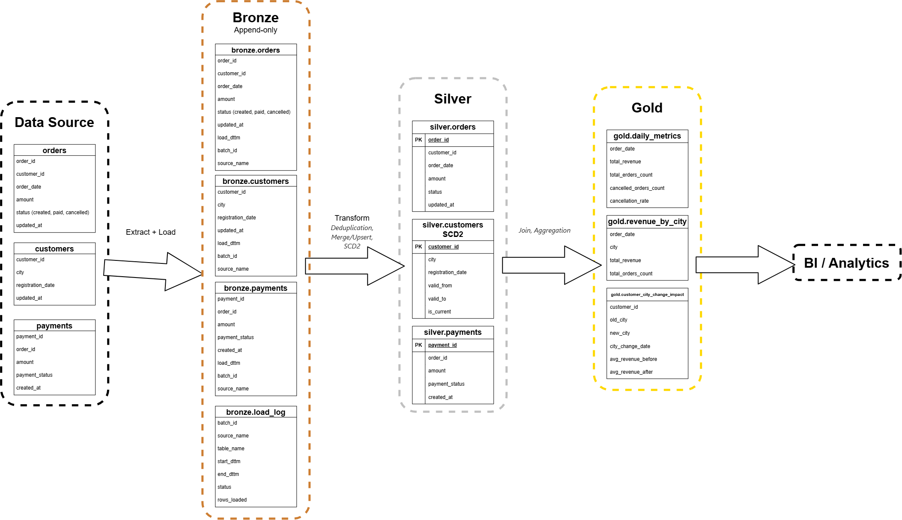
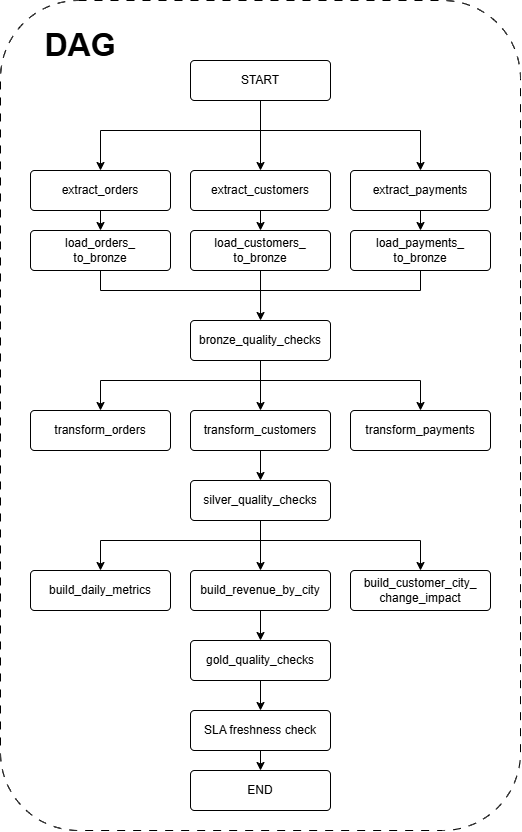

# Отчёт по выполнению домашнего задания Схема ELT-процесса под бизнес-задачу

## 1. Источники данных

**Orders**
- order_id
- customer_id
- order_date
- amount
- status
- updated_at

Особенности:
- около 5 млн строк в день;
- возможны дубликаты;
- updated_at иногда не изменяется при смене статуса;
- статус может приходить с задержкой до 1–2 часов.

**Customers**
- customer_id
- city
- registration_date
- updated_at

Особенности:
- город может изменяться;
- история изменений отсутствует;
- возможны поздние изменения;
- около 50 тыс. изменений в день.

**Payments**
- payment_id
- order_id
- amount
- payment_status
- created_at

Особенности:
- нет updated_at;
- возможны дубликаты;
- платеж может прийти позже заказа.

## 2. Архитектура ELT-пайплайна

Для решения задачи предлагается использовать ELT-архитектуру с разделением данных на три основных слоя: Bronze, Silver и Gold.

- **Bronze** - хранение данных, полученных из источников, с минимальными изменениями.
- **Silver** - очистка, дедупликация, стандартизация, обработка изменений и формирование согласованной модели данных.
- **Gold** - бизнес-метрики и аналитические витрины, подготовленные для BI-инструментов.

### 2.1 Схема пайплайна

### 2.2 Назначение слоев

**Bronze**

Хранит данные из источников в структуре, максимально близкой к исходной. Данные загружаются по принципу append-only, то есть новые поступления добавляются, а уже загруженные записи не перезаписываются.

К исходным полям добавляются технические атрибуты:

- load_dttm — время загрузки записи в хранилище;
- batch_id — идентификатор загрузки;
- source_name — наименование источника.

Дополнительно создаётся таблица bronze.load_log, которая хранит информацию о выполнении загрузок:

- batch_id;
- source_name;
- table_name;
- start_dttm;
- end_dttm;
- status;
- rows_loaded.

**Silver**

Предназначен для подготовки и согласования данных:

- приведение типов и форматов;
- дедупликация;
- проверка корректности значений;
- применение изменений к существующим записям;
- формирование истории изменений клиентов;
- согласование связанных данных заказов и платежей.

**Gold**

Содержит готовые для аналитики витрины с рассчитанными показателями и согласованными определениями бизнес-метрик. BI-инструменты обращаются к Gold, не выполняя сложные преобразования самостоятельно.

## 3. Стратегия загрузки данных

Загрузка выполняется один раз в сутки в рамках ночного batch-процесса. 
Максимальная продолжительность пайплайна - 3 часа. Отчёты должны быть готовы к 08:00.

Для оркестрации предлагается использовать Apache Airflow. Он отвечает за расписание, зависимости между задачами, повторные запуски и контроль выполнения.

### 3.1. Заказы (orders)

Поскольку updated_at не всегда отражает изменения статуса, использовать его как единственный признак инкрементальной загрузки нельзя.

Предлагаемая стратегия:
1. Загружать заказы по order_date за скользящее окно последних 3 дней.
2. Сохранять полученные данные в Bronze без перезаписи ранее загруженных записей.
3. В Silver выполнять дедупликацию и обновлять актуальное состояние заказа по order_id.

**Ограничение:** этот подход обнаруживает изменения только у заказов, попадающих в выбранное окно. Если статус изменится у более старого заказа, изменение может быть пропущено.

**Снижение риска:**
- использовать CDC, если источник поддерживает его;
- предусмотреть периодическую сверку исторических заказов;
- при необходимости повторно обрабатывать затронутые периоды.

Если доступен CDC, его следует рассматривать как предпочтительный механизм отслеживания изменений. Инкремент по дате сам по себе не гарантирует обнаружение всех обновлений. 

### 3.2. Клиенты (customers)

Для клиентов в качестве основного признака инкрементальной загрузки используется updated_at, при условии что источник обновляет его при каждом изменении значимых атрибутов.

Предлагаемая стратегия:
1. Хранить watermark - время последней успешно обработанной загрузки.
2. При следующем запуске извлекать записи, у которых updated_at больше watermark за вычетом 24 часов.
3. Загружать полученные записи в Bronze.
4. В Silver сравнивать атрибуты поступившей записи с текущей версией клиента.
5. При изменении города закрывать предыдущую версию и создавать новую запись SCD2.

**Ограничения и риски:**
- если изменение поступит с задержкой более 24 часов, оно может быть пропущено;
- если updated_at не отражает фактические изменения, watermark не сможет гарантировать полноту данных;
- если несколько изменений клиента произошли между загрузками, а источник предоставляет только текущее состояние, промежуточные значения города восстановить не получится.

**Снижение риска:**
- предусмотреть периодическую сверку клиентов;
- при возможности использовать CDC.

### 3.3. Платежи (payments)

В качестве основного признака загрузки используется created_at.

Предлагаемая стратегия:
1. Извлекать платежи за скользящее окно последних 3 дней по created_at.
2. Загружать полученные записи в Bronze по принципу append-only.
3. В Silver добавлять новые платежи по payment_id, предотвращая повторную обработку дубликатов.
4. Платежи, для которых пока не найден связанный заказ, сохранять как несопоставленные и повторно пытаться связать при последующих запусках.

Загрузка платежей выполняется независимо от заказов, поскольку платёж может появиться в источнике позже связанного заказа.

**Ограничения и риски:**

Если created_at отражает момент создания платежа, а сам платёж становится доступен для выгрузки значительно позже, трёхдневное окно может не захватить его.

Кроме того, если payment_status может изменяться после создания платежа, инкремент по created_at не позволит обнаружить такие изменения.

**Снижение риска:**
- использовать CDC;
- выполнять периодическую сверку платежей.

Повторное чтение трёхдневного окна может затрагивать до 15 млн записей заказов и до 15 млн записей платежей при объёме 5 млн новых записей в день. Поэтому необходимо измерить фактическую нагрузку и время выполнения запросов.

Для соблюдения ограничений рекомендуется использовать CDC при наличии, индексы по полям отбора, партиционирование и ограничение объёмов извлечения. При этом наличие индекса или партиционирования само по себе не гарантирует, что запрос уложится в установленное время.

## 4. Стратегия обновления таблиц
Инкрементальная загрузка определяет, какие данные извлекаются из источника, а стратегия обновления определяет, как эти данные применяются в Silver и Gold.

| Таблица | Стратегия | Ключ | Обоснование |
| :--- | :--- | :--- | :--- |
| `silver.orders` | MERGE / UPSERT | `order_id` | Заказ может изменять статус, поэтому необходимо обновлять его актуальное состояние |
| `silver.customers` | SCD Type 2 | `customer_id` + `city`| Требуется сохранять историю изменений города клиента |
| `silver.payments` | Append-only с проверкой уникальности | `payment_id` | Новые платежи добавляются, дубликаты отсекаются |
| `gold.daily_metrics` | Пересчёт затронутых дат или MERGE | `order_date` | Поздние изменения в заказах могут влиять на уже рассчитанные показатели |
| `gold.revenue_by_city` | Пересчёт затронутых дат или MERGE | `order_date` + `city` | Изменения заказов и клиентских данных могут повлиять на агрегаты |

### 5. Стратегия хранения истории клиентов

Для silver.customers предлагается использовать SCD Type 2, поскольку город клиента может изменяться, а аналитике может потребоваться информация о том, в каком городе клиент находился в определённый период.

## 5.1 Структура таблицы SCD2

**silver.customers**

|Поле|Тиа|Назначение|
|-|--------|---|
|customer_id|BIGINT|Уникальный идентификатор клиента|
|city|VARCHAR|Город клиента в данной версии|
|registration_date|DATE|Дата регистрации|
|valid_from|TIMESTAMP|Начало действия версии|
|valid_to|TIMESTAMP|Окончание действия версии|
|is_current|BOOLEAN|Признак актуальной версии|

Для актуальной версии valid_to может быть NULL, а is_current имеет значение TRUE.

## 6. Подход к дедупликации данных

Дедупликация выполняется в слое Silver. В Bronze записи сохраняются в исходном виде, включая возможные дубликаты, чтобы не потерять информацию и иметь возможность повторной обработки.

### 6.1. Orders

Уникальным бизнес-ключом является order_id.

Если в Bronze есть несколько записей с одинаковым order_id, необходимо определить, являются ли они повторной загрузкой одного состояния или различными версиями заказа.

- Идентичные записи считаются техническими дубликатами.
- Различающиеся версии обрабатываются с учётом надёжной последовательности событий.
- Если порядок изменений установить нельзя, конфликтующие записи помещаются в карантин для проверки.

### 6.2. Customers

Для клиентов используется customer_id.

Повторная загрузка той же версии клиента не должна приводить к созданию новой записи SCD2. Перед созданием новой версии сравниваются отслеживаемые атрибуты, прежде всего city.

Если атрибуты не изменились, новая историческая версия не создаётся.

### 6.3. Payments

Для платежей используется payment_id.

- Идентичные записи с одним payment_id считаются дубликатами.
- Если данные отличаются, необходимо выяснить, является ли это изменением платежа или ошибкой источника.
- Если достоверно определить актуальную версию нельзя, запись отправляется на проверку.

Повторный запуск пайплайна не должен создавать дополнительные платежи в Silver.

## 7. Витрины Gold

Gold предназначен для формирования бизнес-метрик и аналитических витрин, которые будут использоваться BI-инструментами.

Предлагается создать следующие витрины.

### 7.1. gold.daily_metrics

Гранулярность - один день.

| Поле | Назначение |
| :--- | :--- |
| `order_date` | Дата заказа |
| `total_revenue` | Выручка за день |
| `total_orders_count` | Количество заказов |
| `cancelled_orders_count` | Количество отменённых заказов |
| `cancellation_rate` | Доля отменённых заказов |

### 7.2 gold.revenue_by_city

Гранулярность - день и город клиента.

| Поле | Назначение |
| :--- | :--- |
| `order_date` | Дата заказа |
| `city` | Город клиента на дату заказа |
| `total_revenue` | Выручка по городу |
| `total_orders_count` | Количество заказов |

Для исторически корректной аналитики город определяется по SCD2 на дату заказа. Это позволит избежать ситуации, когда все старые заказы клиента автоматически относятся к его текущему городу.

### 7.3 gold.customer_city_change_impact

Эта витрина предназначена для анализа показателей клиентов до и после изменения города.

| Поле | Назначение |
| :--- | :--- |
| `customer_id` | Идентификатор клиента |
| `old_city` | Предыдущий город |
| `new_city` | Новый город |
| `city_change_date` | Дата зафиксированного изменения |
| `avg_revenue_before` | Средняя выручка за выбранный период до изменения |
| `avg_revenue_after` | Средняя выручка за выбранный период после изменения |

Необходимо заранее определить длительность периодов до и после изменения города, а также правила расчёта средней выручки.

## 8. Контроль качества данных и мониторинг

Для обеспечения корректности пайплайна необходимо реализовать проверки качества данных и мониторинг выполнения.

## 8.1. Проверки качества данных

| Слой | Проверка | Ожидаемый результат |
| :--- | :--- | :--- |
| Bronze | Наличие обязательных полей и успешная загрузка | Данные получены из источника |
| Bronze | Контроль количества загруженных строк | Нет необъяснимых отклонений |
| Silver | Отсутствие дубликатов по ключам | Уникальные актуальные записи |
| Silver | Корректность сумм и статусов | Нет недопустимых значений |
| Silver | Целостность связей заказов и платежей | Несопоставленные платежи учтены отдельно |
| Silver | Проверка SCD2 | Нет пересекающихся периодов, одна актуальная версия клиента |
| Gold | Сверка агрегатов с Silver | Метрики соответствуют исходным данным |
| Gold | Проверка полноты и свежести | Витрины актуальны к установленному времени |

Записи, не прошедшие проверки, не удаляются. Их нужно помещать в отдельную карантинную таблицу или журнал ошибок с указанием причины отклонения.

## 8.2. Мониторинг

Предлагается отслеживать:
- статус каждой задачи DAG;
- длительность выполнения этапов;
- количество извлечённых, загруженных и обработанных строк;
- количество дубликатов и отклонённых записей;
- число несопоставленных платежей;
- отклонение объёмов данных от обычных значений;
- время последнего успешного обновления витрин;
- соблюдение SLA.

Для реализации могут использоваться Apache Airflow для оркестрации, Great Expectations или Soda для проверок качества, а также Grafana и Prometheus для мониторинга.

## 9. Оркестрация ELT-процесса

Для управления процессом предлагается использовать Apache Airflow.

### 9.1. Последовательность выполнения DAG

### 9.2 Принцип работы

1. DAG запускается один раз в сутки по расписанию.
2. Три независимые задачи извлекают данные из источников и загружают их в Bronze параллельно.
3. После завершения загрузок выполняются проверки качества Bronze.
4. Три независимых потока обрабатывают заказы, клиентов и платежи в Silver.
5. Выполняются проверки качества Silver.
6. Строятся витрины Gold.
7. Проводятся проверки готовности витрин, после чего данные становятся доступны BI-инструментам.

Для каждой задачи должны быть предусмотрены:
- повторные запуски при временных ошибках;
- логирование результата;
- возможность переиграть загрузку за определённый период.

## 10. Основные риски и компромиссы

| Риск | Возможное последствие | Способ снижения риска |
| :--- | :--- | :--- |
| Ненадёжный `updated_at` заказов | Потеря изменений статусов | CDC, сверка исторических заказов |
| Позднее поступление данных | Неполные данные в витринах | Скользящее окно, повторная обработка, CDC |
| Дубликаты в источниках | Завышенные показатели | Дедупликация в Silver|
| Отсутствие истории клиентов | Невозможность восстановить прошлые состояния до запуска пайплайна | SCD2 с момента начала сбора истории |
| Изменение статуса платежа без `updated_at` | Неактуальные статусы платежей | CDC |
| Превышение трёхчасового окна | Несвоевременная готовность отчётов | Инкрементальная загрузка, параллелизация, оптимизация |

## 11. Ответственность участников процесса

| Роль | Зона ответственности |
| :--- | :--- |
| Владелец источника / разработчик операционной системы | Описание полей, правил изменения данных, доступ к источнику, возможность CDC |
| Data Engineer | Загрузка Bronze, инкремент, SCD2, дедупликация, DAG, мониторинг |
| Data Analyst | Модель Silver, бизнес-логика, подготовка Gold-витрин |
| BI Developer | Подключение BI-инструментов и создание отчётов |
| Бизнес-заказчик | Согласование определений метрик, требований к отчётности и приёмка результатов |
| Data Platform / DevOps | Инфраструктура, доступы, ресурсы и технический мониторинг |

## 12. Заключение

Предложенная архитектура ELT-пайплайна разделяет хранение исходных данных, их обработку и подготовку аналитических витрин.

Инкрементальная загрузка позволяет снизить объём передаваемых данных и нагрузку на источники. Дедупликация и стратегии обновления в Silver обеспечивают согласованность данных, а SCD2 позволяет сохранять историю изменений городов клиентов. Витрины Gold предоставляют готовые показатели для BI-отчётности.

При этом выбранные стратегии загрузки заказов и платежей основаны на временных окнах и имеют ограничения в отношении поздних изменений. Поэтому до внедрения необходимо проверить надёжность временных полей, доступность CDC, фактическую нагрузку на источники и продолжительность всех этапов обработки.   
