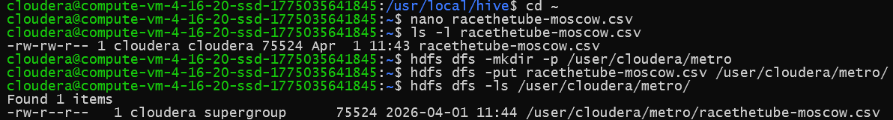
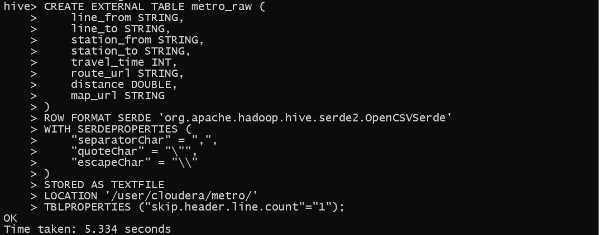
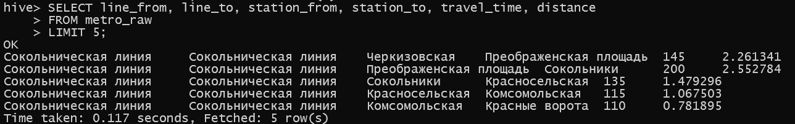
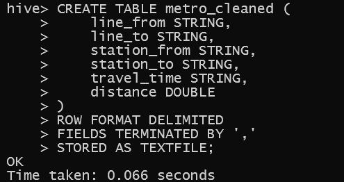
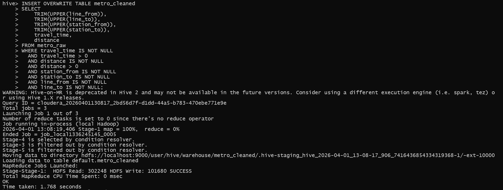
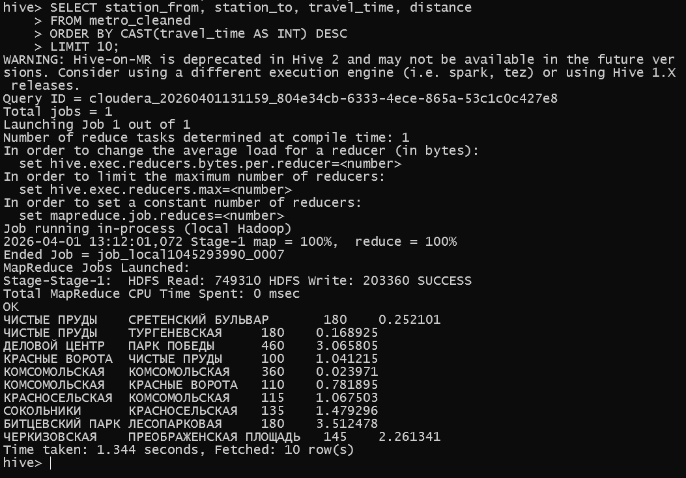

# Отчёт по выполнению домашнего задания «HDFS»

Чтобы выполнить задание, была создана виртуальная машина в Yandex Cloud (Ubuntu 20.04 LTS). На ВМ установлены Hadoop 3.3.6 и Hive 2.3.9, настроен псевдораспределённый режим HDFS. Подключение к ВМ осуществлялось по SSH с использованием сгенерированного ключа.

## 1. Подготовка данных и загрузка в HDFS

Файл racethetube-moscow.csv был скопирован на виртуальную машину через SSH (с помощью nano создан файл, вставлено содержимое).

- Создана директория в HDFS:
`hdfs dfs -mkdir -p /user/cloudera/metro`
- Выполнена загрузка файла:
`hdfs dfs -put racethetube-moscow.csv /user/cloudera/metro/`

Проверка:
 

## 2. Создание внешней таблицы metro_raw

В Hive выполнен следующий SQL-запрос:

 

## 3. Проверка данных

Для проверки корректности чтения выполнен запрос:

## 4. Создание очищенной таблицы metro_cleaned

Создана внутренняя таблица для хранения очищенных данных:

 

## 5. Миграция данных

Выполнена вставка данных из сырой таблицы в очищенную с применением:

- приведения названий к верхнему регистру и удаления лишних пробелов (TRIM(UPPER(...)))

- фильтрации строк с некорректными значениями (NULL, нулевые или отрицательные значения)

 

## 6. Запрос к очищенной таблице

Запрос для определения топ-10 самых длительных перегонов по времени в пути:

 