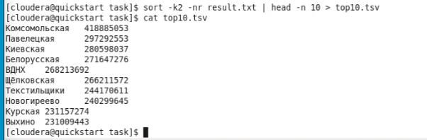
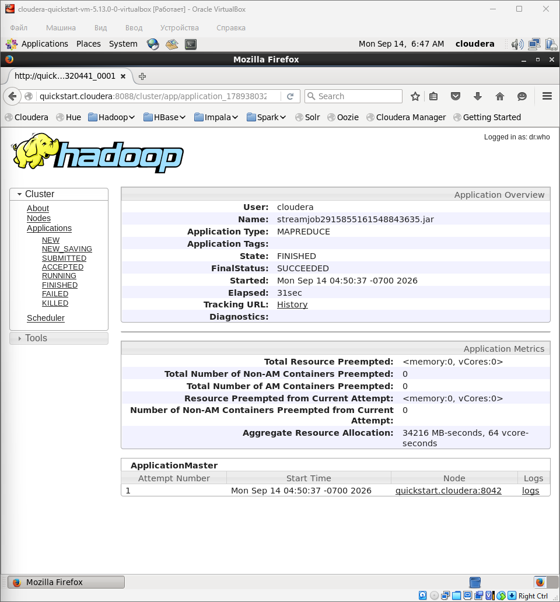
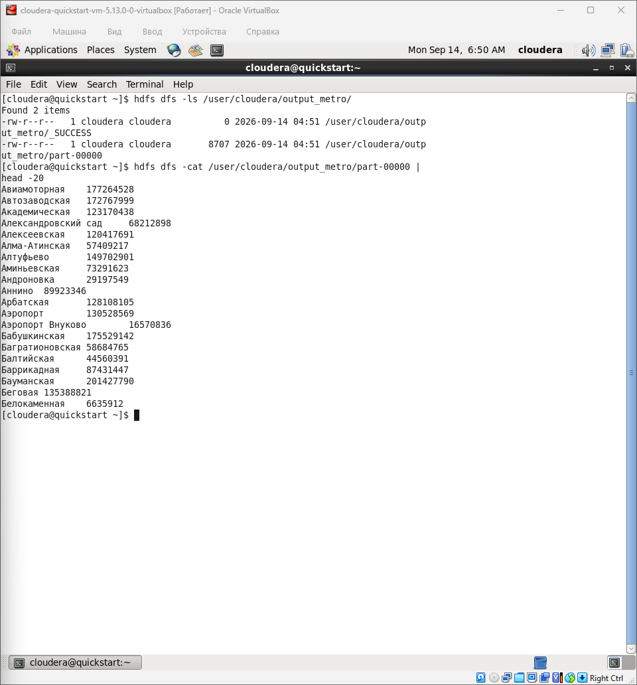

# Отчёт по выполнению домашнего задания MapReduce

## Цель задания
Построить MapReduce-задачу, которая обрабатывает CSV-файл с данными о пассажиропотоке Московского метрополитена, вычисляет суммарный пассажиропоток по каждой станции (passenger_flow = entries + exits) и определяет топ-10 наиболее загруженных станций.

## Исходные данные
Файл metro.csv

## Логика решения

### Mapper (mapper.py)
Mapper построчно читает stdin, разбивает строку по символу точка с запятой, пропускает заголовки (две строки), убирает кавычки и лишние пробелы из названий станций и чисел. Проверяет, что entries/exits - корректные целые числа; при ValueError строка отбрасывается. Вычисляет passenger_flow = entries + exits. Выводит пару station и passenger_flow.

### Reducer (reducer.py)
Reducer построчно читает stdin, разбивает строку по табуляции на ключ (станция) и значение, суммирует значения для каждой станции. При смене ключа выводит накопленный результат в формате station и total_flow.

## Запуск
Загрузка данных в HDFS и запуск задачи выполняются скриптом run.sh. Скрипт выполняет следующие действия: 

1. Загружает metro.csv в HDFS 
```
hdfs dfs -mkdir -p /user/cloudera/input
hdfs dfs -put -f ~/task/metro.csv /user/cloudera/input/
```
2. Запускает MapReduce через Hadoop Streaming
```
hadoop jar /usr/lib/hadoop-mapreduce/hadoop-streaming.jar \
  -input /user/cloudera/input/metro.csv \
  -output /user/cloudera/output_metro \
  -mapper mapper.py \
  -reducer reducer.py \
  -file mapper.py \
  -file reducer.py
```
3. Выгружает результат из HDFS в result.txt
```
hdfs dfs -get -f /user/cloudera/output_metro/part-00000 ~/task/result.txt
```
4. Формирует файл top10.tsv 
```
sort -k2 -nr ~/task/result.txt | head -n 10 > ~/task/top10.tsv
```

## Топ-10 станций 


## Интерпретация результатов
Топ-10 наиболее загруженных станций Московского метро - это крупные пересадочные узлы и станции у железнодорожных вокзалов (Комсомольская, Павелецкая, Киевская, Белорусская, Курская). Лидирует «Комсомольская» - станция в Москве, обслуживающая сразу три вокзала (Ленинградский, Ярославский, Казанский) и имеющая переход между Сокольнической и Кольцевой линиями. Высокие позиции конечных станций с притоком пригородных пассажиров (ВДНХ, Щёлковская, Новогиреево, Выхино) объясняются их ролью пересадочных хабов на наземный транспорт и электрички. Распределение подтверждает, что основной пассажиропоток метро формируется в центре и на радиальных направлениях, связывающих жилые районы с вокзалами и деловыми кварталами.

## Скриншоты
Детали успешно завершённой задачи в YARN
 
HDFS 
 

## Состав архива
- mapper.py - скрипт Map-фазы. 
- reducer.py - скрипт Reduce-фазы. 
- run.sh - скрипт запуска задачи.
- top10.tsv — топ-10. 
- yarn.png - скриншот работы YARN. 
- hdfs.png - скриншот вывода HDFS.
